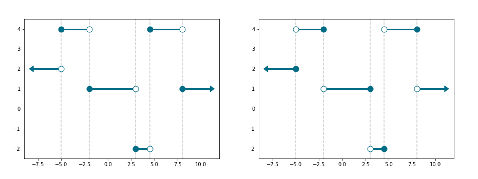
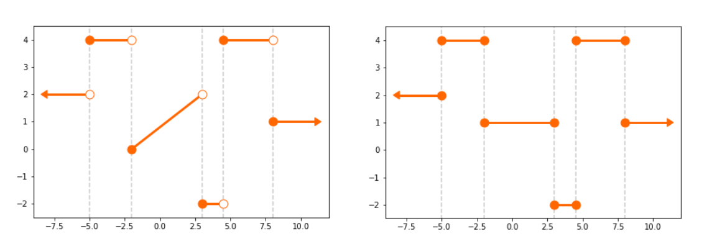

.. _getting_started:

***************
Getting started
***************

Introduction
============

The staircase package is used to measure step functions.  We discuss what a step function is below, but first let's talk application.  Step functions can be used to represent time series - think changes in state over time, queue counts over time, utilisation over time - you get the idea.  

The staircase package makes converting raw, temporal data into time series easy and readable.  Furthermore there is a rich variety of :ref:`arithmetic operations <api.arithmetic_operators>`, :ref:`relational operations <api.relational_operators>`, :ref:`logical operations <api.logical_operators>`, to enable analysis, in addition to functions for :ref:`univariate analysis <api.summary_statistics>`, :ref:`aggregations <api.multi_stair>` and compatibility with `pandas.Timestamp <https://pandas.pydata.org/pandas-docs/stable/reference/api/pandas.Timestamp.html>`_.

.. _getting_started.step_function:

What is a step function?
=========================

A step function, also known as a staircase function, is a piecewise constant function defined over the real numbers.  It can be characterised as a function f defined over a sequence of disjoint intervals, whose union is the set of all real numbers, and where f(x) = f(y) whenever x and y belong to the same interval.

The staircase package can be used to model step functions where intervals have non-zero length (i.e. intervals must be defined by two distinct endpoints) and are either all left closed right-open, or all left-open right-closed.  Below we show two examples of step functions, in the left plot the step function is composed of left closed right-open intervals, and in the right plot the step function is composed of left-open right-closed intervals. 

   
   **Two examples of step functions**
   

To help clarify the characteristics of a step function we show four plots below which do not contain step functions, and give details why:

* Top-left: Not a function
* Top-right: Union of intervals is not entire set of real numbers
* Bottom-left: Union of intervals is not entire set of real numbers
* Bottom-right: The function is not piecewise constant
   

   
   **Examples of mappings which are not step functions**
   
More information on step functions, including formal definitions, can be found on `Wikipedia <https://en.wikipedia.org/wiki/Step_function>`_.
   

A small example
===============
   
The number of users viewing this webpage over time can be modelled as a step function.  The value of the function increases by 1 every time a user arrives at the page, and decreases by 1 every time a user leaves the page.  Let's say we have this data in vector format (i.e. tuple, list, numpy array, pandas series).  Specifically, assume *arrive* and *leave* are vectors of times, expressed as minutes past midnight, for all page views occuring yesterday.  Creating the corresponding step function is simple.  To achieve it we use the :ref:`Stairs <api.Stairs>` class:

.. code-block :: python

   >>> import staircase as sc
   
   >>> views = sc.Stairs()
   >>> views.layer(arrive,leave)

We can visualise the function with the plot function:

.. code-block :: python

   >>> views.plot()

.. figure:: img/pageviews.png
   :width: 60%
   :alt: pageviews example created with plot function
   :align: center

We can find the total time the page was viewed:

.. code-block :: python

   >>> views.integrate(0,1440)

We can find the average number of viewers:

.. code-block :: python

   >>> views.mean(0,1440)

   
We can find the average number of viewers for each hour of the day:
.. code-block :: python

   >>> [views.mean(60*i, 60*(i+1)) for i in range(24)]

We can find the maximum concurrent views:

.. code-block :: python

   >>> views.max(0,1440)

See :ref:`examples and case studies <examples>` for more in-depth demonstrations of the staircase package. 
   
The staircase API
=================

The :ref:`API Reference <api>` contains a detailed description of the staircase API. The 
reference describes how the methods work and which parameters can be used. 
It assumes that you have an understanding of the key concepts.