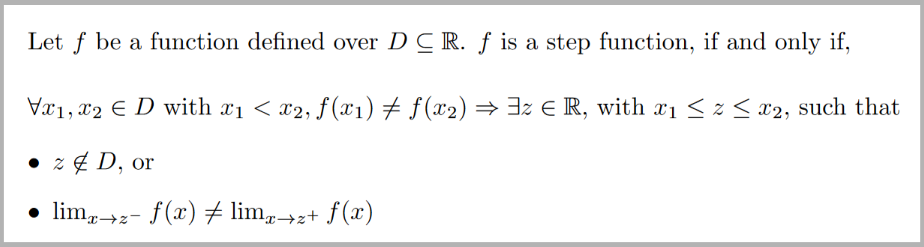
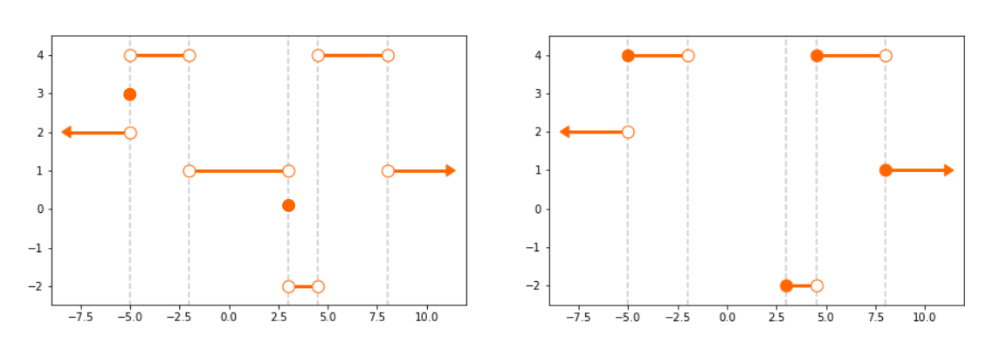
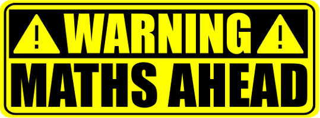

.. _getting_started:

***************
Getting started
***************

Introduction
============

The staircase package is used to model step functions.  We discuss what a step function is below, but first let's talk application.  Step functions can be used to represent time series - think changes in state over time, queue counts over time, utilisation over time - you get the idea.  

The staircase package makes converting raw, temporal data into time series easy and readable.  Furthermore there is a rich variety of :ref:`arithmetic operations <api.arithmetic_operators>`, :ref:`relational operations <api.relational_operators>`, :ref:`logical operations <api.logical_operators>`, to enable analysis, in addition to functions for :ref:`univariate analysis <api.summary_statistics>`, :ref:`aggregations <api.multi_stair>` and compatibility with `pandas.Timestamp <https://pandas.pydata.org/pandas-docs/stable/reference/api/pandas.Timestamp.html>`_.

.. _getting_started.step_function:

What is a step function?
=========================

A step function, also known as a staircase function, is a piecewise constant function defined over the real numbers.  It can be characterised as a function f defined over a sequence of disjoint intervals and where f(x) = f(y) whenever x and y belong to the same interval.

.. rst-class:: center

**A formal definition:**

The staircase package can be used to model step functions over the real numbers.  Below we show two examples of step functions, in the left plot the step function is composed of left-closed right-open intervals, and in the right plot the step function is composed of left-open right-closed intervals. 

.. figure:: img/staircase_function_examples.png
   :width: 100%
   :alt: examples of step functions
   :align: center
   
   **Two examples of step functions**
   
To help clarify the characteristics of a step function we show two plots below which do not contain step functions.  The chart on the left shows a function which is not piecewise-constant while the chart on the right shows a relation that fails to be a function.
   
.. figure:: img/not_staircase_function_examples.png
   :width: 100%
   :alt: not step functions
   :align: center
   
   **Two examples of relations which are not step functions**
   
Currently, the staircase package is not capable of encapsulating all step functions.  Specifically, it does not accommodate step functions with degenerate intervals, i.e. intervals of the form :math:`[a,a]` which contain a single number only, and the domain must be `simply connected <https://mathworld.wolfram.com/SimplyConnected.html>`_, i.e. the function is defined for all real numbers.  The figure below shows two step functions which cannot currently be modelled with staircase.  Both step functions do not have simply connected domains, and the left has degenerate intervals.

   
   **Two examples of step functions which cannot be modelled with the staircase package**

   
More information on step functions can be found on `Wikipedia <https://en.wikipedia.org/wiki/Step_function>`_.

.. _getting_started.interval_endpoints:

A note on interval endpoints
=============================

   
In general, it is possible for the disjoint intervals comprising a step function to be `closed, half-closed or open <https://mathworld.wolfram.com/Interval.html>`_.  However the staircase package does not explicitly model which interval endpoints are open and which are closed - and it does not model the value of the step function at the interval endpoints.  In fact, the limitations of the staircase package are perhaps summarised by the following statement:

	Let :math:`z \in \mathbb{R}` and :math:`f` a step function with a simply connected domain.  The staircase package does not provide functionality to evaluate :math:`f(z)`.  Instead it can only evaluate :math:`f(z) = \lim_{x \to z^{-}} f(x)` or :math:`f(z) = \lim_{x \to z^{+}} f(x)`.

This is why staircase cannot accommodate step functions with degenerate intervals.  The value of :math:`f(z)` however can be inferred under certain assumptions.  Let :math:`S` be the set of step functions with simply connected domains, and containing no degenerate intervals. Furthermore, let :math:`S_L \subseteq S` and :math:`S_R \subseteq S` be those step functions having only left-closed right-open intervals, and left-open right-closed intervals respectively, then

- If :math:`f \in S_L` then :math:`f(z) = \lim_{x \to z^{+}} f(x)`
- If :math:`f \in S_R` then :math:`f(z) = \lim_{x \to z^{-}} f(x)`

Note that by definition, any step function containing a degenerate interval cannot belong to :math:`S_L` or :math:`S_R`.  The class in the staircase package which provides an abstraction for step functions has a method *sample* which, depending on a parameter, calculates either :math:`\lim_{x \to z^{-}} f(x)` or :math:`\lim_{x \to z^{+}} f(x)`.  The sample method can then be interpreted as calculating :math:`f(z)` if :math:`f \in S_L \cup S_R`.

Futhermore, :math:`(S', op)`, where :math:`S' \in \{S_L, S_R\}` and :math:`op \in \{+, *, -, >, \geq, <, \leq, ==, !=\}`, is a group. In layman's terms, if we perform an operation :math:`op` on two step functions belonging to :math:`S_L` then the result also belongs to :math:`S_L`.  The same goes for :math:`S_R`.  This is not true however for :math:`S`.  For example, let :math:`f(x) = 1` if and only if :math:`x \geq 0`, and :math:`0` otherwise, and let :math:`g(x) = 1` if an only if :math:`x > 0`, and :math:`0` otherwise.  In this example  :math:`f \in S_L` and :math:`g \in S_R`.  The result of :math:`f + g` is a step function which does not belong to :math:`S` since it contains the degenerate interval :math:`[0,0]`.

In conclusion, it is recommended that users adopt the convention to assume all step functions belong to :math:`S_L`, or alternatively :math:`S_R`.

A small example
===============
   
The number of users viewing this webpage over time can be modelled as a step function.  The value of the function increases by 1 every time a user arrives at the page, and decreases by 1 every time a user leaves the page.  Let's say we have this data in vector format (i.e. tuple, list, numpy array, pandas series).  Specifically, assume *arrive* and *leave* are vectors of times, expressed as minutes past midnight, for all page views occuring yesterday.  Creating the corresponding step function is simple.  To achieve it we use the :ref:`Stairs <api.Stairs>` class:

.. code-block :: python

   >>> import staircase as sc
   
   >>> views = sc.Stairs()
   >>> views.layer(arrive,leave)

We can visualise the function with the plot method:

.. code-block :: python

   >>> views.plot()

.. figure:: img/pageviews.png
   :width: 60%
   :alt: pageviews example created with plot method
   :align: center

We can find the total time the page was viewed:

.. code-block :: python

   >>> views.integrate(0,1440)

We can find the average number of viewers:

.. code-block :: python

   >>> views.mean(0,1440)

   
We can find the average number of viewers for each hour of the day:
.. code-block :: python

   >>> [views.mean(60*i, 60*(i+1)) for i in range(24)]

We can find the maximum concurrent views:

.. code-block :: python

   >>> views.max(0,1440)

See the :ref:`case studies <resources.tutorials>` for more in-depth demonstrations of the staircase package. 
   
The staircase API
=================

The :ref:`API Reference <api>` contains a detailed description of the staircase API. The 
reference describes how the methods work and which parameters can be used. 
It assumes that you have an understanding of the key concepts.